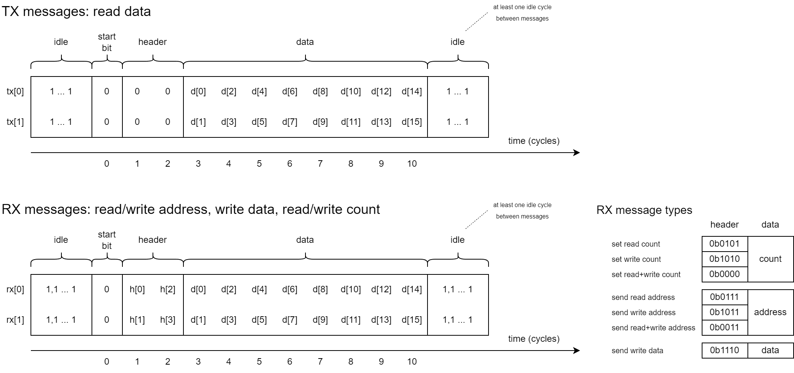

pio-ram-emulator: A RAM emulator on RP2040 using only PIO and DMA for response handling
=======================================================================================
`pio-ram-emulator` is a RAM emulator written for [Tiny Tapeout](https://tinytapeout.com/).
It can run on a RP2040 microcontroller (such as the one on the [Tiny Tapeout Demo Board](https://github.com/TinyTapeout/tt-demo-pcb)), and provide RAM to a design on a Tiny Tapeout chip.

Features:

- 128 kB of RAM: `2^16` addresses x 16 bits
- 4-pin serial interface: one _RX channel_ and one _TX channel_, each using 2 pins
	- All messages begin with a start bit to add freedom in message timing and reduce dependence on communication latency
- Achievable bandwidth with user project clocked at 50 MHz (RP2040 at clocked at 100 MHz):
	- Random access: > 8 MB/s read or > 4 MB/s write (or a mix, such as > 4 MB/s read and > 2 MB/s write at the same time)
	- Block transfers: > 8 MB/s read and 8 MB/s write at the same time, with >= 48 sixteen bit words per transaction
- No CPU involvement except for initialization
	- Response handling is implemented using the RP2040 PIO and DMA for low latency and predictable behavior
- 22 cycles from start bit of read message sent to start bit of first read data message received (as measured using the [test code](pico-ice/ram-emu-test/) on a [Pico-Ice](https://pico-ice.tinyvision.ai/))
	- ==> 12 cycles read latency if counting from the last address bit sent
	- Pin input and output registers included in the latency
	- RP2040 clocked at 50 MHz, iCE40UP5K FPGA clocked at 25 MHz

Also in this repository

- [Documentation](docs/pio-ram-emulator.md)
- [Test code](pico-ice/ram-emu-test/) to test the RAM emulator and measure its read latency using a [Pico-Ice](https://pico-ice.tinyvision.ai/)
- [Pico-Ice version](pico-ice/ram-emu/) of the RAM emulator
