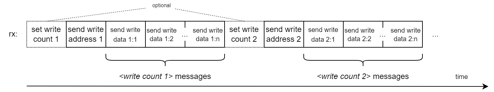
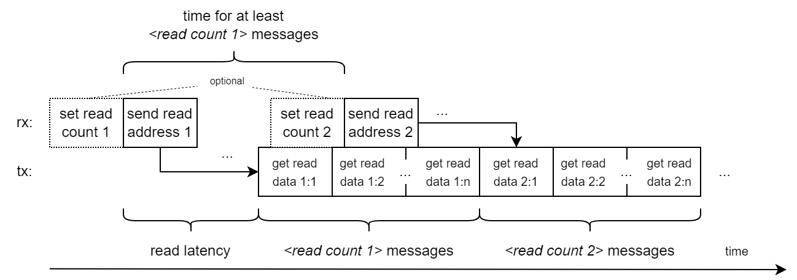
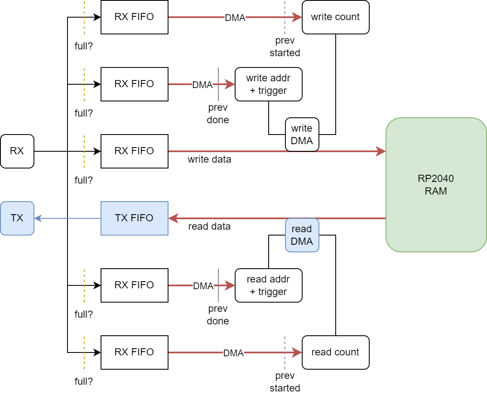

Overview
========
`pio-ram-emulator` is a RAM emulator written for [Tiny Tapeout](https://tinytapeout.com/).
It can run on a RP2040 microcontroller (such as the one on the [Tiny Tapeout Demo Board](https://github.com/TinyTapeout/tt-demo-pcb)), and provide RAM to a design on a Tiny Tapeout chip.

Features:

- 128 kB of RAM: `2^16` addresses x 16 bits
- 4-pin serial interface: one _RX channel_ and one _TX channel_, each using 2 pins
	- All messages begin with a start bit to add freedom in message timing and reduce dependence on communication latency
- Achievable bandwidth with user project clocked at 50 MHz (RP2040 at clocked at 100 MHz):
	- Random access: > 8 MB/s read or > 4 MB/s write (or a mix, such as > 4 MB/s read and > 2 MB/s write at the same time)
	- Block transfers: > 8 MB/s read and 8 MB/s write at the same time, with >= 48 sixteen bit words per transaction
- No CPU involvement except for initialization
	- Response handling is implemented using the RP2040 PIO and DMA for low latency and predictable behavior
- 22 cycles from start bit of read message sent to start bit of first read data message received (as measured using the [test code](../pico-ice/ram-emu-test) on a [Pico-Ice](https://pico-ice.tinyvision.ai/))
	- ==> 12 cycles read latency if counting from the last address bit sent
	- Pin input and output registers included in the latency
	- RP2040 clocked at 50 MHz, iCE40UP5K FPGA clocked at 25 MHz

Writing to memory
-----------------

Writing to memory is accomplished by the sequence:

- Optionally, send a **set write count** message (otherwise, the last set write count is retained; initial value is one)
- Send a **send write address** message with the desired address; this starts a _write transaction_ of `<write count>` 16 bit words
- Send `<write count>` **send write data** messages in sequence
	- The first message contains the 16 bit word to be written to the write address
	- The second message (if write count > 1) contains the 16 bit word to be written to the next address, etc

A new write can be initiated as soon as all write data for the last last one has been sent.

Reading from memory
-------------------

Reading from memory is accomplished by the sequence:

- Optionally, send a **set read count** message (otherwise, the last set read count is retained; initial value is one)
- Send a **send read address** message with the desired address; this triggers a _read transaction_ of `<read count>` 16 bit words
- After a read latency, the RAM emulator starts to return **get read data** messages
	- The first message returns the 16 bit word at the read address
	- The second message (if read count > 1) returns the 16 bit word at the next address, etc

When the read count is > 1, each new **get read data** message will start 12 cycles after the last one started.
A new read can be initiated as long as the new **send read address** message starts at least `12 * <last read count>` cycles after the previous **send read address** message started,
so that the **get read data** messages for the response will not collide with those from the previous read.

The read latency has so far been found to be 22 cycles, but there may be circumstances when it is smaller or greater.
With 22 cycles of read latency, (when the read count is one) if sending two read addresses back-to-back, the first read response message will arrive just before the second **send read address** message has been sent.

Mixing reads and writes
-----------------------
Messages for reading and writing can be freely mixed in the RX channel, as long as the above constraints are satisfied.
There are even some combined read+write messages:

- **set read+write count**: Set the read and write count to the same value. As above, the current count is sampled whenever a new read/write address is sent.
- **send read+write address**: Start a read transaction and a write transaction starting from the same address

For **send read+write address**, the read transaction should return the old data, since it will start to read and return data immediately, while the write transaction will wait for each **send write data** message before it can write the corresponding word, so it should never be able to catch up with the read transaction.

Message formats
===============

TX and RX messages have very similar formats, with start bit, header bits, data bits, and stop bit, except that the header bits in TX messages are always zero.
The fact that the TX and RX messages have the same fields with the same length allows the user project to respond to a TX message (**get read data**) with a response message such as **send write data** or **send read/write address** on the fly, while the TX message is being received.

There will always be at least on idle cycle between TX messages. There must always be at least one idle cycle between RX messages sent to the RAM emulator.

How it works
============

The requirement to handle messages without involving the CPU places quite severe restrictions on the implementation.
The RP2040 runs at twice the clock rate of the user project. The PIO programs and the timing are adapted specifically to this case.

The RAM emulator allows the user project to take control of one read DMA channel and one write DMA channel in the RP2040, called the _main_ DMA channels:

- Each message type is handled by its own PIO state machine and DMA channel
- Write data messages feed data to the main write DMA channel
- Data for read data messages is fed from the main read DMA channel
- The read/write address/count messages cause a write to the `READ_ADDR_TRIG/WRITE_ADDR_TRIG` or `TRANS_COUNT` register of the corresponding main read/write DMA channel
	- Sending a read/write address thus triggers the main read/write DMA channel, using the currently set transfer count
- One PIO program is reused in two PIO SMs for setting read/write count, and one is reused for sending read/write address
- PIO programs for writing respond to header data from `rx[0]`, while PIO programs for reading respond to header data from `rx[1]` (`jmp pin, target` can only respond to one pin for a given PIO SM)

The user must make sure that:

- A new read/write count is not written to the corresponing `TRANS_COUNT` until after the previous transaction (that should use the previous count) has been started
- A new read/write address is not written to the corresponding address register until the previous transaction is finished (or the new transaction will not start)
- The RX FIFOs are not overfilled
- The TX FIFO is not overfilled

In practice, it seems that

- Since RX messages are spaced at least 12 cycles apart, they are unable to overfill the RX FIFOs
	- as long as **send write data** messages are not sent before their corresponding **send write address** message
- By the time a **set read/write count** message arrives after a previous **send read/write address** message, the previous transaction has already started
- Following the described sequence for writes should be enough to avoid writing a new address to `WRITE_ADDR_TRIG` before the previous write transaction has finished
- Waiting to start **send read address** messages at least `12 * <last read count>` cycles after the previous **send read address** message both avoids overfilling the TX FIFO and writing a new address to `READ_ADDR_TRIG` before the previous read transaction has finished

This seems to hold so far in experiments. If additional (possibly higher priority) DMA channels are added to the code that runs in the RP2040, or the DMA is not granted priority above the CPU, these timing assumptions might be violated.

Limitations and todo
--------------------
The four DMA channels that receive counts and addresses will stop after `2^32-1` counts/addresses received.
This can be avoided by using four additional DMA: one for each of the original four to chain to. This should not be hard, but has not been implemented yet.
